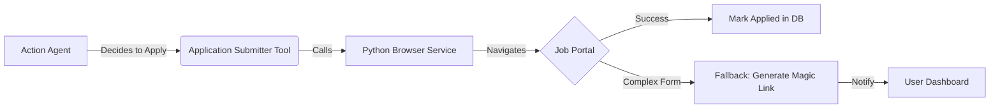
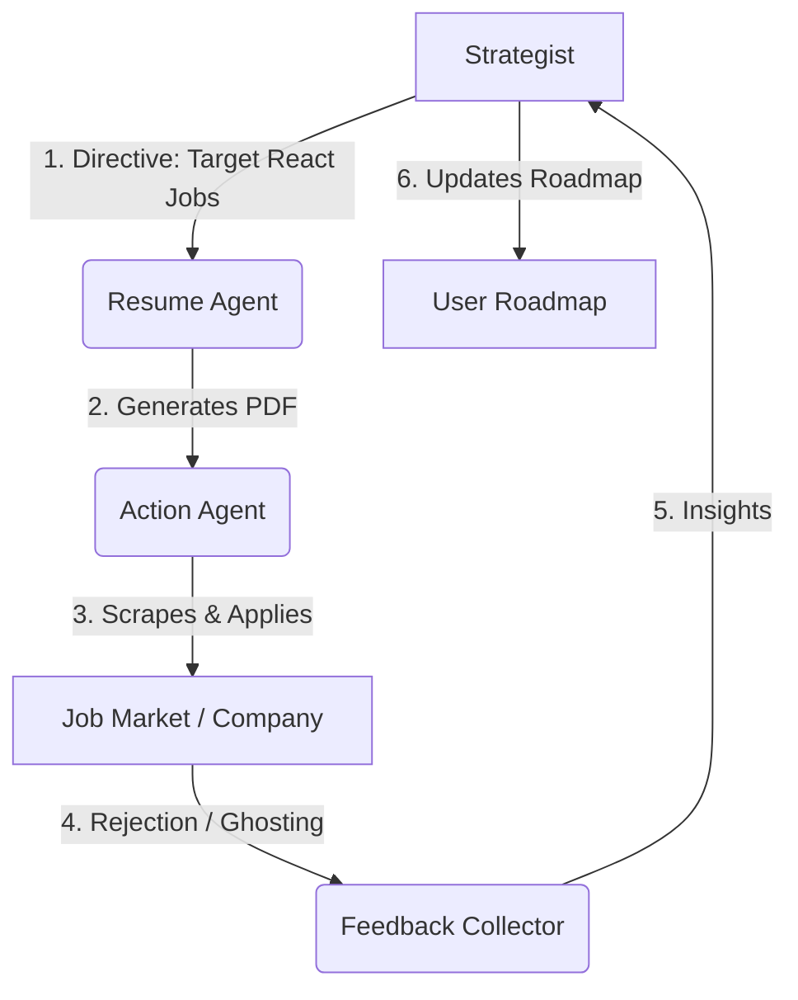

# Remediation: Bridging the Gaps in Action & Strategist Agents

> **Document Version:** 1.0
> **Created:** January 6, 2026
> **Purpose:** Address the functional gaps in the Action Agent (Application Automation) and Strategist Agent (Orchestration Authority) to achieve the "AutoResume" standard of autonomy.

---

## 1. The Core Problem
Our current Architecture is **"Intelligent but Passive."**
*   The **Strategist** *knows* what to do but cannot *order* it done.
*   The **Action Agent** *prepares* the work (cover letters) but cannot *deliver* it (submit forms).
*   User is still the "Router" and "Clicker," breaking the promise of autonomy.

---

## 2. Action Agent Upgrade: From "Writer" to "Submitter"

### Gap Analysis
Currently, the Action Agent's lifecycle ends at `job_applications` table insertion. The user must click a "Apply" link that redirects to Jooble/Company Site. This is manually intensive.

### The Fix: "Browser-Use" Integration (Python Layer)
To achieve true autonomy like `autoresume` (https://github.com/aadya940/autoresume), we must move beyond API calls to **Browser Automation**. Since Apply forms vary wildly (Workday vs. Greenhouse vs. Easy Apply), we need a robust browsing agent.

#### New Architecture Component: `Application Runner` (Python Service)
We will expand the `python-services` monorepo to include a browser automation service using `playwright` or `browser-use`.

**New Tools for Action Agent:**
1.  **`job_application_submitter`**: The "Clicker".
    *   **Input:** `job_url`, `resume_pdf_path`, `user_profile_json`, `cover_letter_text`
    *   **Action:**
        *   Headless Browser navigates to URL.
        *   Detects "Easy Apply" or Standard Form.
        *   Fills fields (First Name, Last Name, Upload PDF).
        *   **CRITICAL:** If it encounters a complex blocker (Login wall, Captcha), it falls back to "Draft Mode".
    *   **Output:** `screenshot_url`, `submission_status` ('submitted', 'drafted', 'failed').

2.  **`form_field_analyzer`**: The "Reader".
    *   **Purpose:** Before applying, scan the page to see if we are missing required info (e.g., "Do you have 5 years of Rust experience?").
    *   **Integration:** If missing info is found, the Action Agent *pauses* and asks the user via Chat Notification, rather than failing.

#### Updated Workflow

*Note: A "Magic Link" is a pre-filled URL or a side-by-side view in our Dashboard where the PDF is already on the clipboard.*

---

## 3. Strategist Agent Upgrade: From "Analyst" to "Commander"

### Gap Analysis
The Strategist currently produces read-only reports (`StrategistOutput`). Ideally, if the Strategist sees "Low Velocity," it should be able to *change the behavior* of the Action Agent (e.g., "Widen search radius" or "Lower salary expectations slightly").

### The Fix: The "Directive" System
We need to give the Strategist "Write Access" to the configuration of other agents.

#### New Tools for Strategist:
1.  **`strategy_directive_emitter`**: The "Command".
    *   **Purpose:** Update the global `UserJobSearchPreferences` or `AgentBehaviorConfig`.
    *   **Example Usage:**
        *   *Scenario:* User failed 3 System Design interviews.
        *   *Action:* Strategist calls `directive_emitter` with `topic="interview_prep"`, `action="block_applications"`, `reason="User needs to pass Mock Interview before applying to Senior roles."`
        *   *Result:* The Action Agent *reads* this block and pauses auto-applications until the block is lifted.

2.  **`search_criteria_tuner`**: The "Adjuster".
    *   **Purpose:** Modify scraping parameters based on market feedback.
    *   **Example Usage:**
        *   *Scenario:* No interviews after 50 applications.
        *   *Action:* Strategist calls `search_criteria_tuner` -> `min_salary -= 10%` or `keywords.add("Remote")`.

#### Database Schema Update
We need a `strategic_directives` table:
```sql
CREATE TABLE strategic_directives (
    id UUID PRIMARY KEY,
    user_id UUID,
    agent_target STRING, -- "action_agent", "resume_agent"
    statusSTRING, -- "active", "resolved"
    directive_type STRING, -- "pause", "parameter_change"
    payload JSONB, -- { "min_salary": 80000 }
    created_at TIMESTAMP
);
```

---

## 4. Remediation Plan

### Phase 1: The "Executor" (Action Agent)
1.  **Python Service:** Add `playwright` and `beautifulsoup4` to `python-services/resume-service` (creating a general `career-automation-service`).
2.  **Endpoint:** Create `/apply` endpoint that accepts a URL and Profile.
3.  **Tool:** Create `submit_application` tool in `src/lib/agents/agents/action/action-tools.ts` that hits this endpoint.
4.  **UI:** Update Dashboard to show screenshots of *autonomous* applications.

### Phase 2: The "Boss" (Strategist Agent)
1.  **Schema:** Add `strategic_directives` to `drizzle/schema.ts`.
2.  **Tool:** Create `issue_directive` tool in `src/lib/agents/agents/strategist/strategist-tools.ts`.
3.  **Logic:** Update Action Agent's `run()` loop to check `strategic_directives` *before* starting work. "Am I allowed to apply today?"

### Phase 3: The "Feedback Loop"
1.  Strategist listens to `APPLICATION_SUBMITTED` events from Action Agent.
2.  Strategist analyzes conversion rates (Applications -> Interviews).
3.  Strategist tunes parameters via directives.

---

## 5. Why this aligns with "AutoResume"
By separating the **Execution** (Python Browser Automation) from the **Logic** (TS Agents), we get the best of both worlds:
*   **AutoResume's Power:** Python's rich ecosystem for scraping (JobSpy) and automation (Playwright/Selenium).
*   **CareerPrep's Intelligence:** Our advanced "Reasoning Layer" that prevents spamming and ensures specific, high-quality targeting.

---

## 6. The Complete Autonomous Loop (The "Career Sprint")

We will implement this as a closed-loop system where feedback drives the next iteration.



### Steps in Detail:

1.  **Resume Generation:** Strategist analyzes current skills and triggers Resume Agent to build a tailored PDF based on User Preferences (e.g., "Remote only", "Startup focus").
2.  **Autonomous Application:**
    *   Action Agent receives the PDF.
    *   Uses **JobSpy** (Python) to scrape high-quality targets (LinkedIn/Indeed) matching the Strategist's criteria.
    *   Uses **Application Runner** (Python/Playwright) to submit applications autonomously.
3.  **Feedback Collection (The Challenge):**
    *   **Gmail Scraper:** We check for explicit rejection emails ("Thank you for applying, but...").
    *   **Ghosting Detector:** If `time_since_application > 14 days` and `no_response`, we classify as "Ghosted".
4.  **Strategist Analysis:**
    *   **Case A: Explicit Rejection:**
        *   Action: Analyze rejection reasons (if provided).
        *   Result: "User lacks System Design depth." -> **Update Roadmap**: Add "System Design" module.
    *   **Case B: Ghosting (The "Silent Rejection"):**
        *   Interpretation: Resume typically failed the ATS or Recruiter Screening (6-second scan).
        *   Result: "Resume is not performant." -> **Directive**: "Rewrite Resume Summary, Increase Keyword Density, or Change Application Timing."

### Handling "Silent Rejections" (Ghosting)
Since roughly 60% of applications receive no response, the Strategist handles this as a specific data signal:
*   **Threshold:** > 14 Days with no contact.
*   **Inference:** "Market Mismatch" or "Resume Weakness" (not "Skill Weakness" because they didn't even interview you).
*   **Strategist Action:**
    1.  **A/B Test:** Directs the Resume Agent to generate *two* versions (e.g., "Creative" vs "Corporate") for the next batch.
    2.  **Volume Adjust:** If ghosting is high, Strategist may advise applying to "easier" matches to build confidence/momentum.

